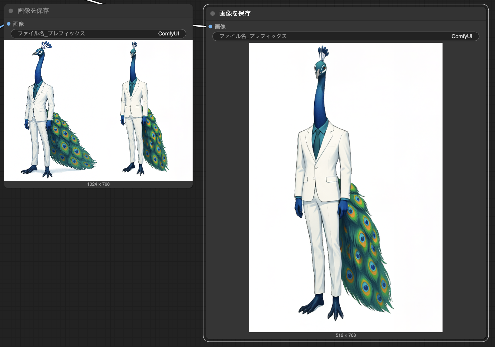
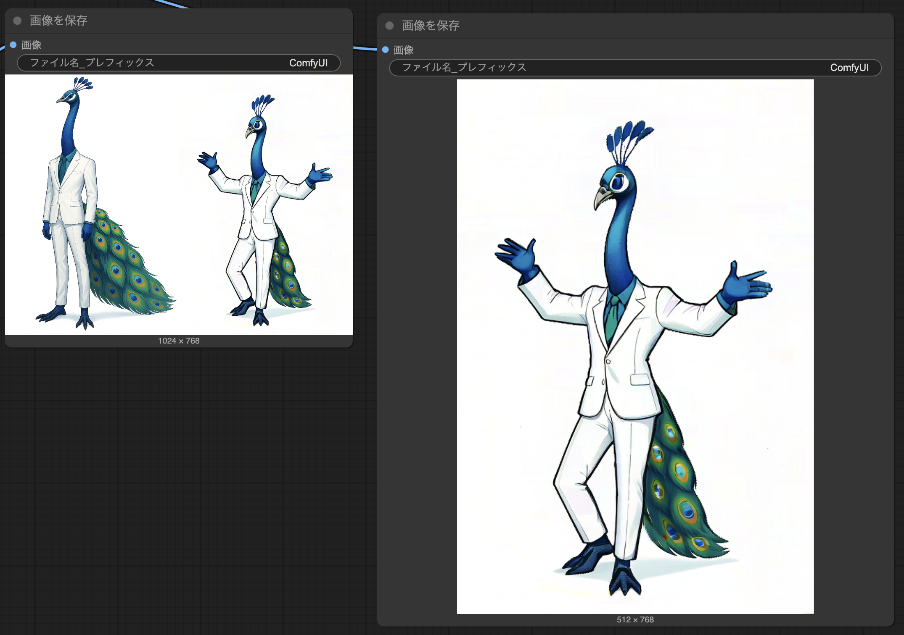
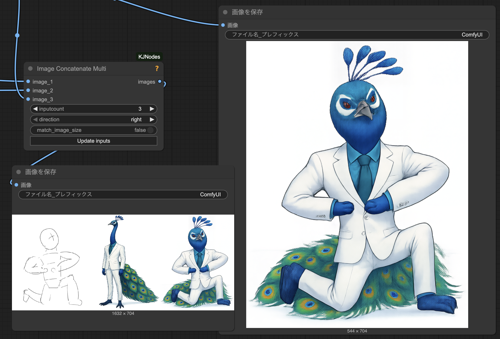

# ComfyUI-FramePackWrapper_PlusOne

[ComfyUI-FramePackWrapper_PlusOne](https://github.com/tori29umai0123/ComfyUI-FramePackWrapper_PlusOne) は、[ComfyUI-FramePackWrapper](https://github.com/kijai/ComfyUI-FramePackWrapper)および[ComfyUI-FramePackWrapper_Plus](https://github.com/ShmuelRonen/ComfyUI-FramePackWrapper_Plus)から派生した、FramePackの1フレーム推論ノード(kisekaeichi対応)を含むフォークです。

本リポジトリは、 @tori29umai0123 氏の[依頼を受けて](https://x.com/tori29umai/status/1928692381735432320)公開用にフォークしました。

## 機能

- **1フレーム推論**: 基本的な1フレーム推論および、kisekaeichi方式に対応しています。技術的詳細は[musubi-tunerのドキュメント](https://github.com/kohya-ss/musubi-tuner/blob/main/docs/framepack_1f.md)を参照してください。
- **F1サンプラー対応**: より高品質で時間的一貫性の高い動画生成のための改良されたF1方式を採用
- **LoRA統合**: 適切な重み付けと融合オプションを備えたHunyuanVideo LoRAの完全サポート
- **タイムスタンプ付きプロンプト**: 特定のタイムスタンプでプロンプトを変更できる動的動画の作成
- **柔軟な入力オプション**: 参照画像と空の潜在空間の両方で完全なクリエイティブコントロールが可能
- **解像度制御**: 最適な動画サイズのための自動バケット検出
- **ブレンド制御**: タイムスタンプ間の異なるプロンプトのスムーズな遷移

### 未対応機能

- 1フレーム推論のうち、f-mc (one frame multi-control) 方式は未対応です。

## インストール

1. このリポジトリをComfyUIのcustom_nodesフォルダにクローンします:
```bash
cd ComfyUI/custom_nodes
git clone https://github.com/xhiroga/ComfyUI-FramePackWrapper_PlusOne.git
```

2. 必要な依存パッケージをインストールします:
```bash
pip install -r requirements.txt
```

3. 必要なモデルファイルをダウンロードして、modelsフォルダに配置します:
- FramePackI2V_HY: [HuggingFace Link](https://huggingface.co/lllyasviel/FramePackI2V_HY)
- FramePack_F1_I2V_HY: [HuggingFace Link](https://huggingface.co/lllyasviel/FramePack_F1_I2V_HY_20250503)

## モデルファイル

### メインモデルオプション
- [FramePackI2V_HY_fp8_e4m3fn.safetensors](https://huggingface.co/Kijai/HunyuanVideo_comfy/blob/main/FramePackI2V_HY_fp8_e4m3fn.safetensors) - Optimized fp8 version (smaller file size)
- [FramePackI2V_HY_bf16.safetensors](https://huggingface.co/Kijai/HunyuanVideo_comfy/blob/main/FramePackI2V_HY_bf16.safetensors) - BF16 version (better quality)

### 必要なコンポーネント
- **CLIP Vision**: [sigclip_vision_384](https://huggingface.co/Comfy-Org/sigclip_vision_384/tree/main)
- **Text Encoder and VAE**: [HunyuanVideo_repackaged](https://huggingface.co/Comfy-Org/HunyuanVideo_repackaged/tree/main/split_files)

## 使用方法

[example_workflows](./example_workflows)を参照ください。

| [1-Frame](./example_workflows/Oneframe.json) / [LoRA @tori29umai](https://huggingface.co/tori29umai/FramePack_LoRA/blob/main/Apose_V7_dim4.safetensors) | [1-Frame](./example_workflows/Oneframe.json) / [LoRA @kohya-ss](https://huggingface.co/kohya-ss/misc-models/blob/main/fp-1f-chibi-1024.safetensors) | [Kisekaeichi](./example_workflows/Oneframe_kisekaeichi.json) / [LoRA @tori29umai](https://huggingface.co/tori29umai/FramePack_LoRA/blob/main/body2img_V7_kisekaeichi_dim4_1e-3_512_768-000140.safetensors) |
| --- | --- | --- |
|  |  |  |

## ライセンス

[MIT License](LICENSE)

## クレジット

- [FramePack](https://github.com/lllyasviel/FramePack): @lllyasviel 氏によるオリジナルの実装です。
- [ComfyUI-FramePackWrapper](https://github.com/kijai/ComfyUI-FramePackWrapper): @kijai 氏によるオリジナルの実装です。
- [ComfyUI-FramePackWrapper_Plus](https://github.com/ShmuelRonen/ComfyUI-FramePackWrapper_Plus): @ShmuelRonen 氏によるF1対応のフォークです。
- [ComfyUI-FramePackWrapper_PlusOne](https://github.com/tori29umai0123/ComfyUI-FramePackWrapper_PlusOne): @tori29umai0123 氏による1フレーム推論対応のフォークです。
